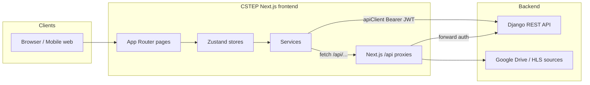
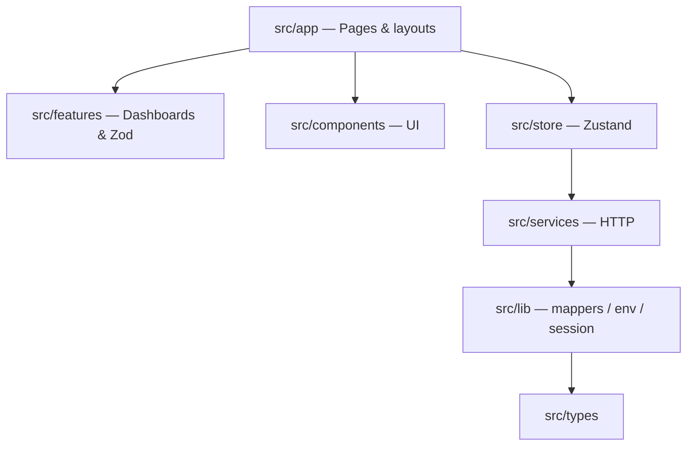
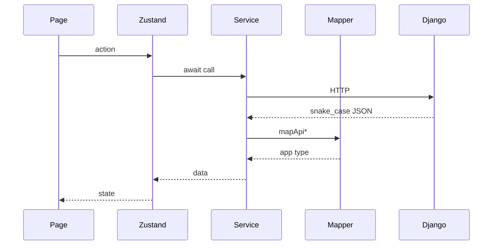

# CSTEP — Event Management Platform

CSTEP is a **Next.js** web application for conference and event operations: delegate registration, lobby management, travel/medical/translation/accommodation assistance, live streaming, analytics, and admin dashboards. The frontend talks to a **Django REST API** backend.

---

## Table of contents

- [Overview](#overview)
- [Tech stack](#tech-stack)
- [Getting started](#getting-started)
- [Environment variables](#environment-variables)
- [Project structure](#project-structure)
- [Architecture](#architecture)
- [User roles & routes](#user-roles--routes)
- [API integration](#api-integration)
  - [How requests are made](#how-requests-are-made)
  - [Django backend endpoints](#django-backend-endpoints)
  - [Next.js API routes (proxies)](#nextjs-api-routes-proxies)
  - [Status value mapping](#status-value-mapping)
- [Key workflows](#key-workflows)
- [Scripts](#scripts)
- [Deployment](#deployment)
- [Changelog](#changelog)

---

## Overview

| Area | Description |
|------|-------------|
| **Public site** | Landing page, event info, sign up / login, event registration |
| **Live streaming** | `/streaming` — video player with optional side banners; Google Drive or HLS sources |
| **Profile** | Delegates request travel, medical, translation, and accommodation support |
| **Dashboard** | Role-based admin tools for lobby, assistance requests (accept / hold / reject), events, users, analytics |
| **Video management** | Broadcast session setup and stream URL management (event administrators) |

The app uses **Zustand** for client state, **React Hook Form + Zod** for forms, **TanStack Table** for data grids, and **Axios** (`apiClient`) for authenticated backend calls.

---

## Tech stack

- **Framework:** Next.js 16 (App Router), React 19, TypeScript
- **Styling:** Tailwind CSS 4, Radix UI primitives
- **State:** Zustand
- **Forms / validation:** react-hook-form, Zod
- **HTTP:** Axios with JWT interceptors and token refresh
- **Streaming:** hls.js, Google Drive embed / proxied video
- **Export:** jsPDF, xlsx

---

## Getting started

### Prerequisites

- Node.js 20+
- npm
- Running Django API (see `NEXT_PUBLIC_API_URL`)

### Install & run

```bash
npm install
cp .env.example .env.local   # then edit values
npm run dev
```

Open [http://localhost:3000](http://localhost:3000).

### Production build

```bash
npm run build
npm start
```

### Clear Next.js cache (if routes break in dev)

```bash
npm run clean
npm run dev
```

---

## Environment variables

Create `.env.local` from `.env.example`:

| Variable | Required | Description |
|----------|----------|-------------|
| `NEXT_PUBLIC_API_URL` | Yes | Django API base URL (e.g. `*******`) |
| `NEXT_PUBLIC_APP_URL` | Recommended | Public frontend URL for share links and redirects |
| `NEXT_PUBLIC_LIVE_STREAM_URL` | Optional | Live stream source (Google Drive preview, `.mp4`, or `.m3u8`) |
| `NEXT_PUBLIC_LIVE_STREAM_FILE_ID` | Optional | Google Drive file ID fallback |
| `NEXT_PUBLIC_STREAM_LEFT_BANNER_URL` | Optional | Left banner image on streaming page |
| `NEXT_PUBLIC_STREAM_RIGHT_BANNER_URL` | Optional | Right banner image on streaming page |
| `NEXT_PUBLIC_BRAND_LOGO_DARK_SRC` | Optional | Dark theme logo path |

`next.config.ts` forwards these into the client bundle at build time. After changing any `NEXT_PUBLIC_*` variable in production, **redeploy** so the build picks them up.

---

## Project structure

```
c-step/
├── .cursor/rules/             # Agent rules (architecture, coding standards, UI/UX, docs)
├── docs/                      # Source PDFs (Concept Note, Agenda); copies served from public/docs/
├── public/                    # Static assets (logos, banner images, conference PDFs)
├── src/
│   ├── app/                   # Next.js App Router pages & API routes
│   │   ├── (auth)/            # login, signup, otp, forgot-password, reset-password
│   │   ├── api/               # Server-side proxy routes
│   │   │   ├── broadcast-sessions/
│   │   │   └── stream/        # Google Drive video proxy
│   │   ├── dashboard/         # Admin dashboard pages
│   │   │   ├── analytics/     # Overview + attendance-mode analytics
│   │   │   ├── accommodation/
│   │   │   ├── events/
│   │   │   ├── feedback/
│   │   │   ├── lobby/
│   │   │   ├── medical/
│   │   │   ├── translation/
│   │   │   ├── travel/
│   │   │   ├── users/
│   │   │   ├── video-management/
│   │   │   └── ...
│   │   ├── event-register/    # Event registration flow
│   │   ├── profile/           # Delegate profile & support requests
│   │   ├── register/          # Legacy/alternate registration
│   │   ├── streaming/         # Live stream viewer
│   │   ├── layout.tsx         # Root layout
│   │   └── page.tsx           # Landing / home
│   ├── components/
│   │   ├── auth/              # Auth guards, PhoneWithCountryCode, SignupLocationFields
│   │   ├── dashboard/         # Admin dialogs, event cards, lobby & analytics UI
│   │   │   ├── AttendanceModeAnalytics.tsx
│   │   │   ├── EventSelectCard.tsx
│   │   │   └── *AssistanceDialog.tsx
│   │   ├── forms/             # Multi-step form shell
│   │   ├── layout/            # Navbar, sidebar, dashboard shell
│   │   ├── profile/           # Profile support forms
│   │   ├── providers/         # Auth, theme providers
│   │   ├── shared/            # DataTable, ExportMenu, guards, etc.
│   │   ├── streaming/         # VideoPlayer, StreamAccessGuard
│   │   └── ui/                # shadcn-style UI primitives
│   ├── features/
│   │   ├── dashboard/         # Role dashboards + Zod schemas (admin-*)
│   │   ├── profile/           # Profile Zod schemas
│   │   └── registration/      # Registration Zod schemas
│   ├── hooks/                 # useRoleGuard, useEventRegistration, etc.
│   ├── lib/                   # Utilities, mappers, env, API client
│   │   ├── api-client.ts      # Axios instance + JWT interceptors
│   │   ├── auth-mappers.ts    # Auth request/response mapping
│   │   ├── country-codes.ts   # Dial codes for signup phone (`country_code`)
│   │   ├── india-states.ts    # Indian states/UTs + default country for +91 signup
│   │   ├── registration-mappers.ts
│   │   ├── event-support-mappers.ts
│   │   ├── event-mappers.ts
│   │   ├── analytics-mappers.ts
│   │   ├── assistance-status.ts
│   │   ├── broadcast-mappers.ts
│   │   ├── stream-utils.ts    # Stream URL parsing (Drive, HLS, mp4)
│   │   ├── date-input.ts      # Date input min values & past-date validation
│   │   └── env.ts             # Public env readers
│   ├── mock/                  # Fallback mock data (dev / API errors)
│   ├── services/              # API service layer (calls Django or proxies)
│   ├── store/                 # Zustand stores
│   └── types/                 # Shared TypeScript types
├── .env.example
├── next.config.ts
├── package.json
└── tsconfig.json
```

---

## Architecture

Agent-oriented architecture guide (layers, domains, Mermaid diagrams, where to put new code): **`.cursor/rules/application-architecture.mdc`** (always applied with coding-standards / UI rules).

**How to describe it:** not a single product monolith — it is a **client–server** system (Next.js UI + Django API). The frontend is a **modular monolith** (one app, layered modules). Not microservices / micro-frontends. See the rule’s “How to explain this” section for elevator pitches.

### System context



### Frontend layers



### Data flow

```
Page / Component
    → Zustand store (optional)
        → service/*.ts
            → apiClient (Axios) → Django REST API
            → fetch("/api/...")  → Next.js route → Django / external
```



- **Pages** (`src/app/`) are route entry points; most dashboard logic lives in page components or `features/dashboard/`.
- **Services** (`src/services/`) encapsulate HTTP calls and error handling. UI should not call `apiClient` directly except in rare cases.
- **Mappers** (`src/lib/*-mappers.ts`) convert between Django snake_case / enum values and app-friendly types.
- **Stores** (`src/store/`) hold UI state, cached lists, loading flags, and orchestrate service calls.

More diagrams (HTTP paths, domains, routes, auth gate): see `.cursor/rules/application-architecture.mdc`.

### Zustand stores

| Store | Purpose |
|-------|---------|
| `useAuthStore` | User session, JWT tokens, login/logout |
| `useEventStore` | Events list, CRUD for admins |
| `useRegistrationStore` | User registration state |
| `useLobbyStore` | Lobby registrations + all assistance types (travel, medical, translation, accommodation) |
| `useEventSupportStore` | Profile event-support form state |
| `useUserStore` | User management (super admin) |
| `useAnalyticsStore` | Dashboard analytics |
| `useFeedbackStore` | Feedback (`GET`/`POST /events/feedback/`) |
| `useRecordingStore` | Recordings (mock-backed) |
| `useHomeDataStore` | Home page upcoming events (registration flag + per-event summary) |

---

## User roles & routes

| Role | Access |
|------|--------|
| `base_user` | Register, profile, streaming (when registered & live) |
| `moderator` | Dashboard lobby + assistance management (accept / hold / reject) |
| `event_administrator` | Above + events, video management, analytics |
| `super_administrator` | Above + user management |

### Main routes

| Path | Description |
|------|-------------|
| `/` | Landing page |
| `/login`, `/signup`, `/otp` | Authentication |
| `/event-register` | Multi-step event registration |
| `/profile` | Delegate profile & assistance requests |
| `/my-registrations` | Signed-in user’s event registrations (`GET /registrations/registration/my/`) |
| `/feedback` | Multi-day session feedback (all authenticated users) |
| `/streaming` | Live stream (guarded by registration + event phase) |
| `/dashboard` | Role-based dashboard home |
| `/dashboard/lobby` | Manage registrations |
| `/dashboard/sessions` | Event day session scheduler (add / edit / delete / drag) |
| `/dashboard/assistance` | Assistance hub — event-scoped quick launch to enabled assistance managers |
| `/dashboard/travel` | Manage travel assistance |
| `/dashboard/medical` | Manage medical assistance |
| `/dashboard/translation` | Manage translation assistance |
| `/dashboard/accommodation` | Manage accommodation assistance |
| `/dashboard/events` | Event list |
| `/dashboard/video-management` | Broadcast sessions |
| `/dashboard/users` | User admin (super admin) |
| `/dashboard/analytics` | Analytics overview |
| `/dashboard/analytics/attendance-mode` | Attendance mode analytics (event + virtual/physical filters, registration list) |
| `/dashboard/feedback` | Feedback |
| `/dashboard/recordings` | Recordings |

Route guards: `RouteGuard`, `StreamAccessGuard`, `EventRegisterGuard` in `src/components/`.

---

## API integration

### How requests are made

**1. Django API (primary)** — `src/lib/api-client.ts`

```ts
import { apiClient } from "@/lib/api-client";

// GET with auth header (Bearer JWT) attached automatically
const { data } = await apiClient.get("/events/event/upcoming/");

// POST
await apiClient.post("/registrations/registration/", payload);
```

- Base URL: `NEXT_PUBLIC_API_URL` via `getApiBaseUrl()` in `src/lib/env.ts`
- **Authorization:** `Bearer <access_token>` from `auth-session`
- **Token refresh:** On 401/403, client retries once via `POST /auth/token/refresh/`
- **Timeout:** 30 seconds

**2. Next.js API routes (proxies)** — used where server-side access or CORS is needed:

| Client call | Next route | Purpose |
|-------------|------------|---------|
| `fetch("/api/broadcast-sessions")` | `app/api/broadcast-sessions/route.ts` | List/create broadcast sessions |
| `fetch("/api/broadcast-sessions/:id/url?target=...")` | `app/api/broadcast-sessions/[id]/url/route.ts` | Resolve HLS/RTMP URLs |
| `GET /api/stream/video?fileId=...` | `app/api/stream/video/route.ts` | Proxy Google Drive video for `<video>` tag |
| `GET /api/stream/resolve` | `app/api/stream/resolve/route.ts` | Resolve stream metadata |

---

### Django backend endpoints

All paths are relative to `NEXT_PUBLIC_API_URL`. Services live in `src/services/`.

#### Authentication — `auth.service.ts`

| Method | Endpoint | Description |
|--------|----------|-------------|
| `POST` | `/auth/sign_up/` | User registration (`role: BASE_USER`, `country_code` e.g. `+91`, `phone_number`, `gender`, `designation`, `org_type` ORGANISATION/INDEPENDENT, `org_name`, `motivation`, `city`, `state`, `country`, profile fields). For non-`+91`, `state` is sent empty and `country` is free text. |
| `POST` | `/auth/login/` | Login → access + refresh tokens |
| `POST` | `/auth/verify-otp/` | OTP verification (`{ email, otp }` or `{ phone_number, otp }`) |
| `POST` | `/auth/resend-otp/` | Resend OTP (`{ "email": "..." }` or `{ "phone_number": "..." }`) |
| `POST` | `/auth/forgot-password/` | Password reset request (`{ "phone_number": "..." }`) |
| `POST` | `/auth/reset-password/` | Reset password with OTP (`phone_number`, `otp`, `new_password`, `confirm_password`) |
| `POST` | `/auth/logout/` | Logout (refresh token in body) |
| `POST` | `/auth/token/refresh/` | Refresh access token |
| `GET` | `/auth/me/` | Current user profile |
| `PATCH` | `/auth/me/` | Update profile name (`salutation`, `first_name`, `middle_name`, `last_name`) |
| `GET` | `/auth/users/` | Paginated user list (admin) |
| `POST` | `/auth/users/` | Create user (lobby Add Users; same profile fields as signup including `country_code`, `city`, `state`, `country`) |
| `DELETE` | `/auth/users/:id/` | Delete user |

#### Events — `event.service.ts`

| Method | Endpoint | Description |
|--------|----------|-------------|
| `GET` | `/events/event/upcoming/` | Paginated upcoming events (`results[]` with `is_registered` + `summary`) |
| `GET` | `/events/event/dropdown/` | Event options (incl. `allowed_travel` / `allowed_medical` / `allowed_translation` / `allowed_accommodation`) |
| `GET` | `/events/event/?type=upcoming\|live\|past` | Filtered event list |
| `GET` | `/events/event/` | All events |
| `GET` | `/events/event/:id/` | Single event |
| `POST` | `/events/event/` | Create event |
| `PATCH` | `/events/event/:id/` | Update event |
| `DELETE` | `/events/event/:id/` | Delete event |
| `GET` | `/events/event-days/dropdown/?event=` | Event day options (feedback tabs, attendance-mode edit); `{ id, day_number, date, label, allowed_attendance_modes }` |
| `GET` | `/events/schedule-items/?day=` | Schedule items for a day (feedback session list; paginated `results[]`) |
| `GET` | `/events/feedback/?event=` | Paginated feedback (`results[]`: `event_title`, `event_day_date`, `schedule_item_title`, `user_full_name`, rating, comment, …) |
| `POST` | `/events/feedback/` | Create session feedback `{ event, event_date, schedule_item, rating, comment }` |

#### Registrations — `registration.service.ts`, `lobby.service.ts`

| Method | Endpoint | Description |
|--------|----------|-------------|
| `GET` | `/registrations/registration/my/` | Signed-in user’s registrations (array: `registration_dates[{ date, mode }]`, `registered_sessions_count`, `status`, …) |
| `GET` | `/registrations/` | Legacy / alternate registrations list |
| `POST` | `/registrations/registration/` | Create registration. **WHOLE_DAY:** `{ event, day_ids, attendance_mode }`. **MULTI_SESSION:** `{ event, sessions: [{ day, attendance_mode: PHYSICAL \| VIRTUAL, session_ids }] }` |
| `PUT` | `/registrations/registration/:id/` | Update registration |
| `PATCH` | `/registrations/registration/bulk-status/` | Bulk status: `{ ids, status }` |
| `PATCH` | `/registrations/:id/` | Update registration preferences |

**Delegate support requests (profile):**

| Method | Endpoint | Description |
|--------|----------|-------------|
| `POST` | `/registrations/request-travel/` | Request travel support |
| `POST` | `/registrations/request-medical/` | Request medical support |
| `POST` | `/registrations/request-translation/` | Request translation support |
| `POST` | `/registrations/accommodation-assistance/` | Request accommodation |

#### Assistance management (lobby dashboard) — `lobby.service.ts`

| Method | Endpoint | Description |
|--------|----------|-------------|
| `GET` | `/registrations/registration/?event=&page=` | Paginated registrations (lobby). Results include `registration_dates: [{ date, mode: PHYSICAL\|VIRTUAL }]`, `registered_sessions_count`, `status` |
| `GET` | `/registrations/travel-assistance/?event=&page=` | Travel rows |
| `GET` | `/registrations/medical-assistance/?event=&page=` | Medical rows |
| `GET` | `/registrations/translation-assistance/?event=&page=` | Translation rows |
| `GET` | `/registrations/accommodation-assistance/?event=&page=` | Accommodation rows |
| `POST` | `/registrations/travel-assistance/` | Admin add travel |
| `POST` | `/registrations/medical-assistance/` | Admin add medical |
| `POST` | `/registrations/translation-assistance/` | Admin add translation |
| `POST` | `/registrations/accommodation-assistance/` | Admin add accommodation |
| `PUT` | `/registrations/travel-assistance/:id/` | Edit travel |
| `PUT` | `/registrations/medical-assistance/:id/` | Edit medical |
| `PUT` | `/registrations/translation-assistance/:id/` | Edit translation |
| `PUT` | `/registrations/accommodation-assistance/:id/` | Edit accommodation |
| `PATCH` | `/registrations/travel-assistance/bulk-status/` | Bulk accept / hold / reject |
| `PATCH` | `/registrations/medical-assistance/bulk-status/` | Bulk accept / hold / reject |
| `PATCH` | `/registrations/translation-assistance/bulk-status/` | Bulk accept / hold / reject |
| `PATCH` | `/registrations/accommodation-assistance/bulk-status/` | Bulk accept / hold / reject |

#### Analytics — `analytics.service.ts`

| Method | Endpoint | Description |
|--------|----------|-------------|
| `GET` | `/analytics/registrations/counts/` | Overview registration status cards (`event_id` query). Response: `total`, `accepted`, `pending`, `on_hold`, `rejected` (`undecided_mode` ignored in UI) |
| `GET` | `/analytics/registrations/trend/` | Registrations-by-day chart (`event_id`, `granularity=daily\|weekly\|monthly`). Response: `{ granularity, results: [{ date, count }] }` |
| `GET` | `/analytics/registrations/insights/` | Attendance donut (`event_id`). Uses `attendance_mode` + `attendance_mode_by_date`; UI shows Physical / Virtual / Mixed only |
| `GET` | `/analytics/registrations/demographics/` | Gender / state / country / designation charts (`event_id`). Uses `by_gender`, `by_state`, `by_country`, `by_designation` |
| `GET` | `/analytics/events/feedback/` | Overview feedback charts (`event`, optional `day`). Response: `overall` (`feedback_by_date[]`, totals), `by_day[]` (`event_date`, `day_number`, count), `by_session[]` |
| `GET` | `/analytics/streaming/summary/` | Live Event Insights streaming cards + details (`event_id`). Response: `currently_watching`, `unique_viewers`, `broadcast_sessions`, `peak_concurrent_viewers`, watch-time fields, `live_broadcast` |
| `GET` | `/analytics/streaming/participation-trend/` | Participation Trend chart (`event_id`, `mode=all\|physical\|virtual`, `interval_minutes=15`, optional `date=YYYY-MM-DD`). Response: `{ mode, results: [{ bucket_start, count }] }` (empty `results` when no activity) |
| `GET` | `/analytics/registrations/users/` | Attendance Mode analytics table (`event_id`, optional `days__day__date`, optional `days__attendance_mode=PHYSICAL\|VIRTUAL`). Paginated `{ count, total_pages, current_page, results[] }` with `created_at` (Date of Registration) and `updated_at` (Modified; fallback `user.updated_at`) |
| `GET` | `/analytics/dashboard/` | Platform dashboard analytics (overview: users total, top events) |
| `GET` | `/analytics/events/:id/` | Event-scoped analytics (overview: registrations, days, streaming) |

**Hybrid (current):** Registration cards + **Registration Insights** + **streaming summary** + **participation trend** + **Attendance Mode users** call live Django endpoints. Participation Time still uses fixtures from `src/mock/analytics-api-fixtures.ts`. Target shapes are documented in `src/lib/analytics-api-contract.ts`. Overview prefers event **id 11**, else the event with the highest `registeredCount`.

Notable fields the overview expects on **`GET /analytics/events/:id/`**:

- Counts use `total_count` (not `total`) on nested objects.
- `days[]`: `session__day__id`, `session__day__date`, `registrations_count`, `sessions_count`, and **`by_attendance_mode`** per day (for date filter + attendance breakdown).
- `streaming`: `*_count` suffix keys (`broadcast_sessions_count`, `currently_watching_count`, etc.).
- **`participation_time[]`** (Live Event Insights): `{ user_name, email?, logged_in_at, logged_out_at, duration_seconds }` per viewer session.
- **`registration_intervals_by_day[]`** (Participation Trend): per event day, `interval_minutes` (15) and `buckets[]` with `bucket_start` (ISO) and `count` (registrations in that window).
- **`registration_insights`**: `by_day_last_7[{ date, count }]`, `by_attendance_mode`, `by_state`, `by_gender`, `by_designation` for Registration Insights charts.

**Attendance Mode analytics** (`/dashboard/analytics/attendance-mode`) uses `GET /analytics/registrations/users/` with:
- `event_id`
- optional `days__day__date` (`2026-08-19` / `2026-08-20` / `2026-08-21`)
- optional `days__attendance_mode` (`PHYSICAL` / `VIRTUAL`; omitted for All)

#### Broadcast (via Next proxy) — `broadcast.service.ts`

Client calls Next.js routes; server forwards to Django with the user's `Authorization` header.

| Client | Description |
|--------|-------------|
| `GET /api/broadcast-sessions` | List broadcast sessions |
| `POST /api/broadcast-sessions` | Create session |
| `GET /api/broadcast-sessions/:id/url?target=playback.hls` | Get stream URL (HLS, RTMP, etc.) |

---

### Status value mapping

App UI statuses map to Django enums in `src/lib/registration-mappers.ts`:

| App (`RegistrationStatus` / assistance) | API |
|----------------------------------------|-----|
| `pending` | `PENDING` |
| `accepted` | `ACCEPTED` |
| `rejected` | `REJECTED` |
| `on_hold` | `HOLD` |

Lobby and all assistance dashboards support **Accept**, **Hold**, and **Reject** (single row and bulk).

---

## Key workflows

### 1. User registration

1. Sign up → `POST /auth/sign_up/` (includes `country_code` + `phone_number`)
2. **+91 (India):** Verify mobile OTP → `POST /auth/verify-otp/` (signs the user in)
3. **Other country codes:** Skip OTP; auto-login → `POST /auth/login/` with the new email/password
4. Event register → `POST /registrations/registration/` (base users land on `/event-register` when not yet registered)
5. Optional profile support → `POST /registrations/request-*`

### 2. Lobby: add user (two-step wizard)

1. **Signup** → `POST /auth/users/` with `role: BASE_USER`, `country_code`, `phone_number`, `designation`, `org_type`, `org_name`, `motivation`, `city`, `state`, `country` (`auth-mappers.toLobbySignupPayload`)
2. **Register for event** → `POST /registrations/registration/` with `user` id (`registration-mappers.toLobbyRegistrationApiPayload`)

Implemented in `AddLobbyUsersDialog`, `lobby.service.ts`, `useLobbyStore`.

### 3. Live streaming

1. Stream URL from env (`NEXT_PUBLIC_LIVE_STREAM_URL`) or active broadcast HLS via `resolveLivePlaybackUrl()`
2. `VideoPlayer` tries proxied Drive video (`/api/stream/video`) first, falls back to iframe embed
3. `StreamAccessGuard` enforces auth + registration + live event phase

### 4. Assistance moderation

Moderators select rows in DataTable → **Accept** / **Hold** / **Reject** → `PATCH .../bulk-status/` with mapped API status.

**Editing assistance requests** (travel, medical, translation, accommodation): date fields in the edit dialogs cannot be set to a past date. The date picker uses `min={today}` via `getTodayDateInputMin()` in `src/lib/date-input.ts`, and edit Zod schemas (`*-edit` in `features/dashboard/admin-*.schema.ts`) reject past dates on submit. Accommodation **to date** must also be on or after **from date**.

Dashboard assistance schemas use shared field objects plus a `superRefine` callback — do not chain `.omit()` or `.merge()` on schemas that already have refinements (see `admin-travel.schema.ts` and `admin-accommodation.schema.ts`).

---

## Scripts

| Command | Description |
|---------|-------------|
| `npm run dev` | Start development server |
| `npm run build` | Production build |
| `npm start` | Start production server |
| `npm run lint` | Run ESLint |
| `npm run clean` | Delete `.next` cache |

---

## Deployment

Typical deployment target: **Vercel** (frontend) + **Django** (API).

1. Set all `NEXT_PUBLIC_*` variables in the hosting dashboard.
2. Redeploy after env changes.
3. Ensure Django CORS allows your frontend origin.
4. For streaming, confirm Google Drive file is shared as **“Anyone with the link”** if using Drive embed.

---

## Related files for new contributors

| Task | Start here |
|------|------------|
| New API endpoint | `src/services/`, then mapper in `src/lib/` |
| New dashboard page | `src/app/dashboard/`, schema in `features/dashboard/` |
| Auth changes | `auth.service.ts`, `auth-mappers.ts`, `useAuthStore.ts` |
| Registration payload | `registration-mappers.ts`, `registration.service.ts` |
| Assistance forms | `event-support-mappers.ts`, `lobby.service.ts`, `date-input.ts`, `features/dashboard/admin-*.schema.ts` |
| Analytics | `analytics.service.ts`, `analytics-mappers.ts`, `app/dashboard/analytics/`, `AttendanceModeAnalytics.tsx` |
| Streaming | `VideoPlayer.tsx`, `stream-utils.ts`, `streaming/page.tsx` |

---

## Changelog

### 2026-07-24

- **Home — account menu:** Signed-in landing navbar uses a user dropdown with **My Registrations**, **Profile**, and **Logout** (mobile menu lists the same actions).
- **Home — My Registrations:** `/my-registrations` loads `GET /registrations/registration/my/`; empty state links to event registration.
- **Analytics — overview header:** Removed **Event ID** badge; ICAS events show **India Clean Air Summit** under the event title.
- **Analytics — event feedback dates:** Feedback by day maps `by_day.event_date` (labels like `Day 1 · 19 Aug`) from `GET /analytics/events/feedback/`.
- **Analytics — event feedback charts:** Overview Registration Insights adds **Feedback by day** and **Feedback by sessions** from `GET /analytics/events/feedback/?event=` (optional `day`; bars show total feedback count; tooltip includes average rating).
- **Analytics — demographics by_country:** Overview Registration Insights adds a **By country** bar chart from `GET /analytics/registrations/demographics/` `by_country`.
- **Analytics — Attendance Mode dates:** Table/export show **Date of Registration** (`created_at`) and **Modified** (`updated_at`, fallback `user.updated_at`) from `GET /analytics/registrations/users/`.
- **Lobby — registration_dates mode:** List `GET /registrations/registration/` maps `registration_dates: [{ date, mode }]` into day columns (**19 Aug / 20 Aug / 21 Aug**) with Physical, Virtual, or — (same pattern as Attendance Mode analytics; export matches).
- **Signup — country / state by dial code:** For **+91**, show Indian state/UT dropdown only (country field hidden; payload still sends `country: India`). For other country codes, hide state and show country as a text field. Non-India sends empty `state`. Shared UI: `SignupLocationFields` (`src/lib/india-states.ts`).
- **Signup — more dial codes:** Expanded `COUNTRY_DIAL_CODES` in `src/lib/country-codes.ts` (~100 countries; India first, then A–Z).
- **Analytics — weekly trend labels:** Registrations Over Time weekly buckets use `13th July (week beginning)` (horizontal, not slanted) instead of `Week of 13 Jul`.
- **Analytics — Attendance Mode day filter columns:** Choosing a participation day (e.g. **20 Aug**) shows only that day’s mode column; **All days** still shows 19/20/21 Aug.
- **Analytics — Attendance Mode day columns:** Registrations table (and export) uses separate columns for **19 Aug / 20 Aug / 21 Aug**, each showing Physical, Virtual, or —.
- **Feedback — enriched list fields:** Mapper reads `event_title`, `event_day_date`, `schedule_item_title`, `user`, and `user_full_name` from `GET /events/feedback/` so dashboard tables show real event/day/session/user labels.
- **Feedback — list display fix:** Feedback summary now groups live `GET /events/feedback/` rows (was stuck on hardcoded mock session titles, so API data looked empty). Date labels support day ids until calendar dates are returned.
- **Feedback — list API:** Dashboard `/dashboard/feedback` and `/feedback` load from `GET /events/feedback/?event=` (all pages). Mapper supports current fields plus upcoming day / session name / user details when the API adds them.
- **Feedback — submit validation:** Submit requires at least one rated session (matches `POST /events/feedback/`). ICAS Overall is optional. Validation/API errors show next to the submit button instead of failing silently.
- **Feedback — create API:** Submitting multi-day feedback posts one `POST /events/feedback/` per rated session with `{ event, event_date, schedule_item, rating, comment }` (`event` default `11`, `event_date` = day id, `schedule_item` = session id).
- **Feedback — sessions API:** Selecting a feedback day tab loads sessions from `GET /events/schedule-items/?day=<dayId>` (titles + time range). Days still come from `GET /events/event-days/dropdown/`.
- **Feedback — event days API:** Multi-day feedback tabs (`/feedback` and streaming Exit) load from `GET /events/event-days/dropdown/?event=` (default event `11`), with an **ICAS Overall** tab after the day list. Falls back to hardcoded ICAS dates if the API fails.
- **Streaming — back opens feedback:** Browser back on `/streaming` opens the same exit feedback dialog as the **Exit** button (history guard + `popstate`); submit/skip then leave to home.
- **Analytics — Attendance Mode loading:** `/dashboard/analytics/attendance-mode` shows a table skeleton while `GET /analytics/registrations/users/` is in flight (initial load, filter, and page changes).
- **Signup — skip OTP for non-India:** After account creation, only **+91** users go to mobile OTP (`/otp`). Other country codes auto-sign in with the new password and continue to event registration (`resolvePostAuthDestination`).
- **Signup — country code:** Public `/signup` and Lobby Add Users phone fields include a country dial-code selector (`PhoneWithCountryCode`). Payloads send `country_code` (e.g. `+91`) with national `phone_number` via `toSignupPayload` / `toLobbySignupPayload`. Digit length follows the selected country (`src/lib/country-codes.ts`). Gender is still collected and sent. Location fields depend on dial code (see **Signup — country / state by dial code**).
- **Docs — application architecture rule:** Added `.cursor/rules/application-architecture.mdc` (always-on) with layers, domains, data flow, Mermaid diagrams, “how to explain this” (client–server + modular monolith FE), and where to add new work. README Architecture section embeds key diagrams and links to the full set.

### 2026-07-23

- **Streaming — mobile player:** Fixed `/streaming` player collapsing to zero height on small screens (banner grid + absolute video). Player shell always keeps a 16:9 frame with a mobile min-height; side banners stay desktop-only.
- **Analytics — attendance mode API:** Attendance Mode page loads `GET /analytics/registrations/users/` with filters `days__day__date` (19/20/21 Aug) and `days__attendance_mode` (`PHYSICAL` / `VIRTUAL`; All omits the param). Replaces the under-development placeholder. Summary filter cards removed. Export supports **page** and **all** (fetches every page).
- **Analytics — participation trend API:** **Participation Trend** uses `GET /analytics/streaming/participation-trend/` with `mode=all|physical|virtual`, fixed `interval_minutes=15`, and a day selector (`date`). Maps `{ mode, results }`; empty `results` shows an empty state. Day list always includes today.
- **Analytics — streaming summary API:** Live Event Insights cards + **Streaming Details** use `GET /analytics/streaming/summary/?event_id=` (`currently_watching`, `unique_viewers`, `broadcast_sessions`, `peak_concurrent_viewers`, watch-time display strings, `live_broadcast`). Viewer Sessions / Logins rows removed (not in API).
- **Analytics — demographics scroll:** State and designation bar charts list every category (no “Others” bucket) inside a vertically scrollable area so long tails remain visible.
- **Analytics — live data visibility fix:** Registration cards + **Registration Insights** no longer wait on mock event analytics. Overview prefers event **id 11** (or highest `registeredCount`) and uses live API payloads even when counts/charts are empty (no silent mock override).
- **Analytics — demographics API:** Gender, state, country, and designation charts use `GET /analytics/registrations/demographics/?event_id=` (`by_gender`, `by_state`, `by_country`, `by_designation`). State/country/designation bars show all labels with vertical scroll when the list is long.
- **Analytics — attendance insights API:** **How people will attend** uses `GET /analytics/registrations/insights/?event_id=` (`attendance_mode` + `attendance_mode_by_date`). Shows **Physical / Virtual / Mixed** only, with an **All days** / event-day filter.
- **Analytics — registration trend API:** **Registrations by day** uses `GET /analytics/registrations/trend/?event_id=&granularity=` with a **Daily / Weekly / Monthly** toggle.
- **Analytics — registration counts API:** Overview **Registrations** cards load from `GET /analytics/registrations/counts/?event_id=` (`total` → “Total registered for event”, plus Accepted / Pending / Hold / Rejected). `undecided_mode` is ignored.
- **Analytics — Registration Insights polish:** Charts use plain-language titles, people counts/% legends, labeled bars, and clearer donuts so non-technical users can read them easily.
- **Analytics — trends:** Removed **Registration Trend**. **Participation Trend** (15-min intervals) now lives under **Live Event Insights**.
- **Analytics — hybrid overview:** Registration cards/insights call live Django analytics APIs; streaming summary + participation trend are live. Participation Time still uses fixtures.
- **Analytics — Registration Insights charts:** Overview **Registration Insights** shows day-wise (last 7 days with Today/Yesterday), attendance-mode donut, scrollable state/designation bars (all categories), gender donut. Fixture fallback: `src/mock/analytics-registration-insights.ts`.
- **Status — Hold:** Bulk and single hold actions send API status `HOLD`. UI labels use **Hold**.

### 2026-07-22

- **Login — Phone OTP default:** Sign-in opens on **Phone OTP**; users can switch to **UserId/Password**. International users are directed to UserId/Password (OTP not supported outside India).
- **Signup — gender:** Public signup and Lobby Add Users collect required **Gender** (`MALE` / `FEMALE` / `OTHER`), sent as `gender` on `POST /auth/sign_up/` and `POST /auth/users/`.

### 2026-07-21

- **Home — Concept Note & Event Agenda:** Below **About the Conference**, two cards open PDFs in a modal (inline viewer + **Close** and optional new tab). Files live in `docs/` and are served from `public/docs/` (`icas-2026-concept-note.pdf`, `icas-agenda.pdf`); paths in `src/lib/conference-documents.ts`.
- **Home hero — mobile layout:** On small screens, the hero image now appears after the upcoming-event line (and registered notice) and **above** the CSTEP badge and conference title; desktop keeps image left of copy.
- **Analytics overview:** `/dashboard/analytics` is **UI-only** (fixtures in `src/mock/analytics-api-fixtures.ts`; contract in `src/lib/analytics-api-contract.ts`). Collapsible **Trends**, **Registration Insights**, and **Live Event Insights**. Compact trend cards; Participation Trend uses 15-minute intervals with a day selector.

### 2026-07-19

- **Lobby — Add Users signup endpoint:** Step 1 of the moderator/event-admin "Add Users" wizard now creates the account via `POST /auth/users/` (was `/auth/sign_up/`); payload shape unchanged (`toLobbySignupPayload`). Step 2 (event registration) is unchanged.
- **Event registration — Step 3 layout:** Physical/Virtual toggle now sits directly beneath each day chip; sessions cards render only for Virtual days with a date heading. Session cards are shorter on tablet/laptop (`md:p-2.5`) and the scroll controls in `SessionScrollRow` are larger.

### 2026-07-17

- **Event registration — attendance radio toggle:** Step 3 replaces the attendance-mode dropdown with a Physical/Virtual segmented radio control on the date row; sessions appear only after choosing Virtual. Removed the “On-site attendance includes all sessions for this day.” note for Physical. Behavior/payload unchanged.
- **Event registration — compact attendance selector:** Step 3 places each selected date and its attendance-mode control in one responsive row, with a subtle reduced-motion-safe attention indicator and highlighted dropdown.
- **Event registration — session card colors:** Session cards in Step 3 (and lobby Add/Edit registration) use rotating theme-friendly tones with stronger `border-2` outlines, light/dark gradients, time chips, and selected states via `src/lib/session-card-tones.ts`. Speaker line is hidden when no speaker name is provided (no “Speaker TBA”).
- **Signup — designation required:** Designation is mandatory on `/signup` and lobby Add Users (Zod validation, required marker, HTML `required`); signup payloads no longer default empty designation to `"None"`.
- **Event registration — Physical session ids:** Fixed a bug where selecting multiple days as **Physical** only populated `session_ids` for the last day in the registration payload. Selecting a second day no longer cancels the first day’s in-flight session fetch; missing sessions are loaded again at submit via `resolveRegistrationSessionsByDay()` in `src/lib/registration-sessions.ts`.

### 2026-07-16

- **Login — phone OTP option:** The sign-in page now has two login methods: **Email** (password) and **Phone OTP**. The phone flow keeps a small **Verify** button for OTP sending via `POST /auth/otp-login/`, shows OTP input inline, displays a visible `+91` phone prefix, and sends only the 10-digit mobile number in API payloads.
- **Manage Sessions — timeline window:** Session scheduler timeline and time picker now use **8:00 AM – 9:00 PM** (was 9:00 AM – 6:00 PM) for placing and editing sessions/breaks. Day tabs and headings now show the event-day **date** from `GET /events/event-days/` instead of backend `label`, and each hour on the timeline is wider for longer session titles.
- **Manage Sessions — time picker:** Fixed minutes dropdown so it’s not clipped and is scrollable inside the “Add/Edit session” dialog.
- **Manage Sessions — session modal:** Reduced the Add/Edit session modal width and spacing to make the time picker area less cramped.
- **Events — Edit Attendance mode:** Moderators and event admins now see an **Edit Attendance mode** action on each event card in the Events marketplace. It loads days from `GET /events/event-days/dropdown/?event=<id>`, lets staff pick a date and toggle Physical / Virtual (or both), and saves via `PATCH /events/event-days/<dayId>/` with `allowed_attendance_modes`.
- **Event registration — day chips:** Participation day options (e.g. 20th / 21st August) render in a single responsive row instead of stacked full-width cards.
- **API base URL guard:** `getApiBaseUrl()` / `apiClient` reject missing or non-absolute `NEXT_PUBLIC_API_URL` and avoid falling back to the page origin (`localhost`) for Django calls.
- **Event registration — auto Participation step:** On load, the first available event (or `?event=` preset) is auto-selected and the wizard advances to **Participation** (days/sessions); users can still go Back to review personal info or change the event.
- **Signup OTP auto-login:** After mobile OTP on `/otp`, the same `/auth/verify-otp/` token response signs the user in immediately (no separate login step). New base users go to `/event-register` when not yet registered.
- **Lobby — registration list:** `GET /registrations/registration/?event=` maps `registration_dates` (`[{ date, mode }]`) into **19 Aug / 20 Aug / 21 Aug** mode columns. Also uses `registered_sessions_count` and `status`. Lobby table shows day columns + **Sessions** + **Status**.
- **Event registration — session cards:** Wider session cards (~20–22rem) with full wrapping titles (no 2-line clamp) so long session names fit; carousel scroll step increased to match.
- **Lobby — Add Users signup:** Step 1 now matches public `/signup` — designation, organisation type/name, motivation, city/state (address block removed); shared Zod fields via `signup.schema.ts`.
- **Lobby — attendance & sessions:** Add Users / Edit registration match self-registration: **Physical** hides session picker (all sessions included); **Virtual** requires session selection. Per-day modes come from API `allowed_attendance_modes` (e.g. **19 Aug** is Physical only).
- **Event registration — ICAS dates:** Self-registration (`/event-register`) hides **19 Aug 2026** for ICAS events; delegates choose **20 Aug** and **21 Aug** only. **Lobby Add Users / Edit registration** (moderator, event admin) still shows all days including **19 Aug** for admin-assisted registration. Event-day labels use the API `date` field formatted as **20th August** (not backend labels like “Day 1”).
- **Event registration — attendance modes per day:** Step 3 attendance dropdowns respect each event day’s `allowed_attendance_modes` from `GET /events/event-days/`. Days that only allow Physical no longer show Virtual; multi-session events filter per day, and whole-day events use the intersection across selected days.
- **Signup → login → registration flow:** After signup and mobile OTP verification, users are now sent to `/login` (instead of home). On successful login, base users are routed by `is_registered` from `GET /events/event/upcoming/`: `false` → `/event-register`, `true` → home. An explicit `redirect` param still wins, and staff continue to their dashboard.
- **API client — base URL:** `apiClient` now sets `baseURL` from `NEXT_PUBLIC_API_URL` on every request (via interceptor), so login/signup and other calls always hit the Django API host instead of falling back to the page origin (`localhost`).

### 2026-07-15

- **Forgot / reset password — mobile:** Sign-in forgot-password and reset-password now use **mobile number** (`phone_number`) instead of email. OTP is sent to the phone; dashboard Profile password reset uses the signed-in user’s phone as well.
- **OTP — mobile only:** After signup, `/otp` now verifies **mobile only** (email verification commented out). User enters phone OTP, then redirects to home. Resend uses `POST /auth/resend-otp/` with `{ phone_number }`.
- **Event registration — review:** For Physical attendance, Step 4 no longer shows “All sessions for this day”; only the day and attendance mode are listed.
- **Home hero — registered status:** “You’re registered for this event…” now sits directly under the Upcoming Event heading (above the brand badge).

### 2026-07-14

- **Signup — required fields:** First name, last name, phone number, and email now show a required marker (`*`) and clearer empty-field validation messages.
- **Event registration — Physical vs Virtual sessions:** On Step 3 (MULTI_SESSION), **Physical** hides the session picker and auto-selects all sessions for that day; **Virtual** shows the session list for manual selection. After a successful registration, home upcoming data is force-refetched via `GET /events/event/upcoming/` so registration status updates immediately.
- **Signup — new profile fields:** Public signup now collects **Designation**, **Organisation type** (`ORGANISATION` → “Institution or Organisation” / `INDEPENDENT` → “Independent”), **Organisation name** (required when ORGANISATION), **What motivates you to attend this event?**, plus **City** and **State**. `POST /auth/sign_up/` sends flat `designation`, `org_type`, `org_name`, `motivation`, `city`, `state` (nested address removed for public signup).
- **Login redirect fix:** After sign-in, navigation now uses `router.replace` to the home page (base users) or dashboard (staff). Fixed login treating `{ message: "Login successful", tokens, user }` as an error (blocked redirect). Fixed a loop where a **403 permission** response on public APIs after login was treated as session expiry and sent the user back to `/login`.
- **Home page — ICAS dates:** Hero and About sections now show **19th** alongside API dates (e.g. `19th – 21st August 2026` and `19, 20 and 21 August` in the heading) for ICAS events; countdown still uses Aug 19 start.
- **Event registration — error feedback:** Failed `POST /registrations/registration/` now shows the API error message on the registration form for 5 seconds (was silently ignored except for already-registered).
- **OTP — mobile only:** After signup, `/otp` verifies mobile only (`POST /auth/verify-otp/` with `{ phone_number, otp }`); email step disabled. Resend supports `{ phone_number }` (30s cooldown). Previously supported email + mobile two-step flow.
- **Contact email:** Home/About contact updated from `arundati.g@cstep.in` to `icas@cstep.in`.
- **Home page cleanup:** Removed the **FAQs** section (and FAQ links from the navbar/footer). Removed the **registered count** (`N registered`) from the hero metadata row; date and venue remain.

### 2026-07-13

- **Moderator dashboard — registered users fix:** The Moderator dashboard summary cards now aggregate the event summaries from `GET /events/event/upcoming/` (`total_registered_users`, `participants_attended/accepted/rejected/pending/held`) instead of `GET /analytics/dashboard/`, which was reporting `users.total` as `0`. "Registered Users" (and the other cards) now reflect the actual per-event counts.

### 2026-07-11

- **OTP — resend:** The email verification page now has a **Resend OTP** action (`POST /auth/resend-otp/` with `{ email }`) for when the code is invalid/expired. Includes a 30s cooldown (`Resend OTP in Ns`), clears the entered code, and shows a success confirmation.
- **Events list — upcoming source:** The dashboard events "Upcoming" tab (and every `getEvents("upcoming")` caller) now loads from `GET /events/event/upcoming/` instead of `/events/event/?type=upcoming`, because the upcoming payload includes the `allowed_travel` / `allowed_medical` / `allowed_translation` / `allowed_accommodation` flags — so the Edit Event dialog can prefill the assistance toggles. Live/past tabs still use `/events/event/?type=`.
- **Base user — post-registration assistance:** After a base user completes event registration, if the chosen event enables any assistance (`allowed_travel` / `allowed_medical` / `allowed_translation` / `allowed_accommodation`), they're routed to `/profile?event=<id>&services=<enabled>` which shows **only** the enabled assistance forms to fill (submits to `/registrations/request-travel|request-medical|request-translation|accommodation-assistance/`) then returns home; a **Maybe later** skip also goes home. When the event enables no assistance, registration goes straight home. `EventSupportRequestForm` now accepts `allowedServices` (filter) + `lockEvent` (hide event picker); `buildProfileSupportUrl(eventId, services)` carries the enabled list.
- **Manage Assistance (Lobby):** New **Lobby → Manage Assistance** tab (`/dashboard/assistance`). Loads `GET /events/event/dropdown/` and, based on each event's `allowed_travel` / `allowed_medical` / `allowed_translation` / `allowed_accommodation` flags, shows quick-launch cards for **Manage Travel / Medical / Translation / Accommodation** (hidden when a type is `false`). Selecting a card sets the lobby event and opens the matching management page. `EventDropdownOption` now carries the four assistance booleans.
- **Profile page (dashboard):** Moderators / event admins can now update their name (salutation, first, middle, last) and reset their password from **Settings → Profile**. Name update sends `PATCH /auth/me/`. Password reset reuses the OTP flow: **Send OTP** calls `POST /auth/forgot-password/` with `{ phone_number }` for the signed-in mobile, then OTP + new password submit to `POST /auth/reset-password/`. Uses react-hook-form + Zod with inline validation and success/error feedback; updated name syncs into the auth store.
- **Event creation — assistance flags:** Create/Edit event form now has 4 boolean toggles — **Travel**, **Medical**, **Translation**, **Accommodation** assistance — so event admins/moderators declare which assistance types an event offers (types left off are hidden in the lobby). Payload sends `allowed_travel` / `allowed_medical` / `allowed_translation` / `allowed_accommodation` (backend live); `Event` maps them back.
- **Docs — Event registration user guide:** Added `docs/EVENT_REGISTRATION_USER_GUIDE.md` covering the end-user journey (sign up → verify email → sign in → register for event) with required fields and the per-day multi-session participation flow.
- **Event registration — MULTI_SESSION payload:** `POST /registrations/registration/` now sends `{ event, sessions: [{ day, attendance_mode, session_ids }] }` with per-day attendance (`PHYSICAL` / `VIRTUAL`). Step 3 supports **multi-day** selection; each selected day has its own attendance mode and session multi-select.
- **Manage Lobby — Add Users:** MULTI_SESSION registration matches the new multi-day sessions payload and UI (per-day attendance + sessions).
- **Manage Lobby — Edit registration:** MULTI_SESSION edit now uses the same multi-day flow (per-day attendance + session multi-select), prefilled from the `days[]` detail response, and sends the `sessions[]` payload on `PUT`.
- **Manage Lobby — registration list:** `GET /registrations/registration/` response now returns `registered_days_count`; added a **Days** column (and CSV/Excel/PDF export field) alongside **Sessions**.
- **Manage Lobby — session details:** `GET /registrations/registration/{id}/` now nests sessions under `days[]` (each with `day_number`, `date`, `attendance_mode`, `sessions[]`). The session details dialog groups sessions per day with a per-day attendance badge; approve/reject and bulk status still act on each session registration id.
- **Manage Lobby — session bulk status endpoint:** Bulk approve/reject now posts to `PATCH /registrations/registration-session/bulk-status/` (was `/registrations/sessions/bulk-status/`).
- **Auth — 403 handling:** API responses with `403 Forbidden` (on non–auth-page requests) now clear the session and redirect to `/login` (previously only expired-token `401`s did).
- **Session details fix:** When the same session registration id appears under multiple days, selecting/approving one row no longer toggles the duplicate row in another day (selection keyed per day+session).

### 2026-07-10

- **Auth token expiry:** API responses with `token_not_valid` / expired access token (`401`) clear the local session and redirect to `/login` automatically.
- **Home hero image visibility:** Hero image now uses `object-contain` with no dimming overlays so the CSTEP logo and skyline vectors remain fully visible in light and dark mode.
- **Home hero image card:** Hero image card uses a **2:3 portrait aspect** (matching `Image1.jpg`) at full content height so the image fills the card as one piece with `object-cover` while keeping the CSTEP logo and skyline fully visible; card aligns to the text column on desktop.
- **Home hero typography:** Event title splits before `CONFERENCE` with `leading-none` so multi-line headings have no extra gap; hero text uses tighter spacing to align with the image card.
- **Home hero layout:** Image and event copy centered together as one block (`max-w-6xl mx-auto`); poster beside text with balanced max-width on the copy column.
- **Assistance services disabled:** Travel, medical, translation, and accommodation support commented out in profile, dashboard nav, analytics overview, and post-registration flow (redirects home instead of profile support).
- **Analytics overview:** Removed Food Preferences distribution table from event analytics overview.
- **Attendance mode analytics:** Removed Food Preferences chart/column; added **Sessions** count from `registered_sessions_count` — clicking opens a read-only session details dialog (no approve/reject actions).

### 2026-07-07

- **Home — Contact scroll:** Navbar **Contact** (`#contact`) now scrolls to the “Got any queries?” contact card in the About section (with sticky-header offset); footer no longer uses the `contact` id.
- **Moderator dashboard — Participation Trend:** X-axis labels changed from Week 1–6 to 15-minute time slots starting at **9 AM** (9 AM, 9:15, 9:30, …).
- **Moderator dashboard layout:** Removed Food Requirement table and trend charts from the main dashboard; dashboard now shows **Upcoming**, **Current** (live), and **Past** event sections.
- **Analytics overview:** Registration Trend and Participation Trend charts moved to `/dashboard/analytics`; trends appear **after selecting an event** (with period/mode filters).
- **Lobby — Manage Sessions timeline:** Timeline window is now **9 AM–6 PM** (was 24-hour); removed empty-slot **Open for networking** blocks from the timeline.
- **Attendance mode analytics:** Physical/Virtual registrations table at `/dashboard/analytics/attendance-mode` now supports **Excel/PDF export** (all matching registrations, not just the current page).
- **Live streaming view modes:** `/streaming` player controls offer **Default**, **Theater**, and **Full screen** — theater widens the player, increases height (16:9 scale), and moves live chat below the video (YouTube-style).
- **Live streaming theater sizing:** Tuned theater view dimensions to be slightly smaller for better balance on laptop screens while staying larger than default view.
- **Live streaming theater layout:** Theater mode now uses a balanced grid — wide player on top; event info, current speaker, agenda, and moderator controls on the left; live chat fills the right column with matched height and no wasted space.
- **Hydration warning hardening:** Added `suppressHydrationWarning` to shared form controls (`Input`, `Textarea`, `Button`, `Checkbox`) to avoid noisy extension-injected attribute mismatches (for example `fdprocessedid`) during hydration.
- **Event registration — Step 1:** Event dropdown now loads from `GET /events/event/dropdown/` (`id`, `title`, `scheduled_start`, `scheduled_end`, `schedule_type`) instead of the upcoming events list.
- **Event registration — Step 3:** Participation dates now load from `GET /events/event-days/?event=<id>`; removed **Time of Participation** from the form. For `MULTI_SESSION`, selecting a day fetches `GET /events/schedule-items/dropdown/?day=<dayId>` and shows selectable session cards (multi-select: title, start/end, speaker) before attendance mode; selected ids are sent as `session_ids` on registration submit. For `WHOLE_DAY`, users proceed with only day + attendance mode.
- **Registration session dropdown:** Event registration, Manage Lobby Add Users, and Edit registration now load session options from `GET /events/schedule-items/dropdown/?day=<id>` (Manage Sessions timeline still uses `GET /events/schedule-items/?day=<id>`).
- **Event registration — session cards:** Replaced nested `<button>` + `Checkbox` with a single `role="button"` card and decorative check indicator to fix invalid DOM nesting / hydration warnings.
- **Event registration — API payload:** Registration submit now sends `user`, `event`, `attendance_mode`, and `food_preference`. **MULTI_SESSION** events send `session_ids` (selected schedule items). **WHOLE_DAY** events send `day_ids` (multi-select event days). WHOLE_DAY step 3 UI now supports selecting multiple days.
- **Manage Lobby — registration list:** `GET /registrations/registration/` now filters with `event=<id>` (was `registration__event`). Table/export map the new response fields: `registered_sessions_count`, `attendance_mode`, `food_preference` (replacing participation date/time columns).
- **Manage Lobby — session details:** Moderators/event admins can click a non-zero Sessions count to open a modal that loads `GET /registrations/registration/{id}/` and lists `session_registrations` (title, date, time, track, status).
- **Manage Lobby — session approve/reject:** Sessions in the modal show **Approve** / **Reject** so status can be changed again after a decision (Approve hidden when already accepted; Reject hidden when already rejected). Posts to `/registrations/registration/{registration_id}/sessions/{session_reg_id}/approve/` and `.../reject/`, then refreshes the list.
- **Manage Lobby — session bulk status:** Select multiple sessions in the modal and bulk **Approve** / **Reject** via `PATCH /registrations/registration-session/bulk-status/` with `{ ids, status: "APPROVED" | "REJECTED" }`.
- **Manage Lobby — Add Users:** Step 2 registration now matches public event registration — **WHOLE_DAY** multi-selects `day_ids`; **MULTI_SESSION** picks a day then multi-selects sessions as `session_ids`. Removed participation time / legacy `participation_dates` from this flow.
- **Manage Lobby — Edit registration:** Edit dialog now uses the same **WHOLE_DAY** (`day_ids`) / **MULTI_SESSION** (`session_ids`) flow; loads current selections from registration detail and removes participation time / legacy date radios.
- **Manage Lobby — Edit error popup:** Failed registration updates (e.g. 400 “already registered”) show the API error in a popup with an **OK** button instead of an uncaught promise.
- **Manage Lobby — transient errors:** Page-level red error banner auto-dismisses after 5 seconds.
- **Address fields:** All address inputs are required (with trim validation) except **Address line 2 (optional)** — applies to signup and Manage Lobby Add Users.
- **Event registration — API loop fix:** Stopped retrying lobby `GET /registrations/registration/` on **403** (permission denied) via token refresh, which was causing repeated `registration` + `refresh` calls on `/event-register`. Lobby data is now refetched after token refresh only for **staff** on the matching **dashboard** route (registrations only on `/dashboard/lobby`). Session fetch on Step 3 no longer clears selections on every effect run when the day is unchanged.
- **Event registration — session cards:** Removed the left fade overlay on the session carousel and added inner padding so the first card’s border is no longer clipped.
- **Auth token refresh:** `POST /auth/token/refresh/` now runs only on the **25-minute interval** in `AuthProvider`. Removed tab-focus refresh, 401 interceptor refresh, and hydrate-time refresh; a shared throttle skips duplicate refresh calls within the interval.
- **Event registration — food preference removed:** Dropped the Food step from `/event-register` (now 4 steps: Event → Personal Info → Participation → Review). Public registration submit no longer sends `food_preference` in the API payload.
- **Manage Lobby / admin registration — food preference removed:** Add Users and Edit registration no longer collect or send `food_preference`; lobby table and export no longer include a Food column.
- **Manage Sessions — start time picker:** Add/Edit session modal now uses **12-hour AM/PM** selects (hour, minute, period) instead of the browser 24-hour time input.
- **Manage Sessions — time dropdown clipping:** Hour/minute/period dropdowns in the Add/Edit session modal now open upward to avoid being cut off near the modal bottom.
- **Manage Sessions — valid hour options:** Start-time hour options now match the timeline window by period (**AM:** 9,10,11; **PM:** 12,1,2,3,4,5), so users can always pick valid times like 9 AM without hidden scroll.

### 2026-07-04

- **Dashboard stat cards:** Compact metric cards — reduced padding, `text-xs` titles, `text-xl` values; equal-height grids with `auto-rows-fr`.
- **Moderator dashboard:** Food Requirement shown as a date-filtered table with PDF/Excel export (single day or all dates); registration and participation charts retain period/mode filters.
- **Analytics overview:** Distribution insights shown as tables with PDF/Excel export per section (registration, attendance, food, participation dates, travel, translation, streaming details).
- **Session feedback:** Multi-day feedback on `/streaming` — Exit opens a dialog for all users: 4 sessions per day on **19, 20, and 21 Aug**, daily Overall per day, and **ICAS / Overall Event**; submit or skip navigates home. Moderator view at `/dashboard/feedback` shows summary with respondent names/ratings, filterable comment table (with **Clear filters**), and export.
- **Lobby — Manage Sessions:** Event-first day scheduler at `/dashboard/sessions` — up to 3 day tabs, 24-hour timeline (12 AM–11 PM) with networking gaps in empty slots (add / edit / delete / drag); in-memory, no API.
- **Lobby — Manage Sessions days source:** After selecting an event, day tabs now load from `GET /events/event-days/?event=<id>` (uses backend `results[].date/day_number/label`) so scheduler dates match backend event-day records.
- **Lobby — Add Session API:** Add Session now includes **Session Type** (`SESSION`, `BREAKFAST_BREAK`, `TEA_BREAK`, `LUNCH_BREAK`, `DINNER_BREAK`, `NETWORKING_BREAK`, `CUSTOM_BREAK`) and posts to `POST /events/schedule-items/` with backend payload keys (`day`, `item_type`, `title`, `description`, `start_time`, `end_time`) using the selected event-day id.
- **Lobby — Add Session reliability:** Add-to-timeline now validates selected `day` id before posting and shows a clear error if day id cannot be resolved, avoiding silent API skips.
- **Lobby — Post-add refresh:** After `POST /events/schedule-items/`, scheduler now calls `GET /events/schedule-items/?day=<selectedDayId>` and refreshes that day from backend response.
- **Lobby — Day tab default:** On reload/event selection, scheduler now re-initializes with the first backend day tab selected (e.g. 19 Aug).
- **Lobby — Reload day fetch:** On reload and when switching day tabs, scheduler now calls `GET /events/schedule-items/?day=<selectedDayId>` automatically to hydrate timeline from backend.
- **Lobby — Timeline interactions:** Removed drag-to-move on timeline blocks; sessions are now edited via click (Edit modal) and deleted via block action.
- **Lobby — Timeline spacing:** Increased timeline width scale (more pixels per hour) for clearer hour slots and easier visual planning.
- **Lobby — Timeline spacing:** Timeline scale is now `160px/hour` for wider slot visibility.
- **Events permissions:** Moderators can create, edit, and delete events in `/dashboard/events` (same as event admins/super admins).
- **Lobby — Delete session API:** Deleting a session now calls `DELETE /events/schedule-items/{schedule_item_id}/` and re-fetches `GET /events/schedule-items/?day=<selectedDayId>` to keep timeline in sync.
- **Lobby — Edit session API:** Editing a session now calls `PATCH /events/schedule-items/{schedule_item_id}/` (`item_type`, `title`, `description`, `start_time`, `end_time`) and refreshes selected day data via `GET /events/schedule-items/?day=<selectedDayId>`.
- **Lobby — Delete loading state:** While delete API runs, delete actions are disabled and show a spinner (`Deleting...` in modal / spinner on block delete icon).
- **Watch Live tooltip:** Disabled Watch Live now shows clearer hover guidance for upcoming events — “Live feed starts from 19th August (…)”.
- **Watch Live hover fix:** Tooltip now appears reliably for disabled Watch Live by wrapping the disabled button in a hoverable container.
- **Events form:** Create/Edit Event now includes **Event Type** (`Whole Day` / `Multi Session`) and sends it to backend as `schedule_type` (`WHOLE_DAY` / `MULTI_SESSION`).

### 2026-07-03

- **Home page:** ICAS 2026 content on hero and About section (theme, venue, highlights, contact) from [CSTEP ICAS 2026](https://cstep.in/events/india-clean-air-summit-icas-2026/).
- **Home hero countdown:** `EventCountdown` sits inline with Register / Watch Live; counts down to ICAS start (`19 Aug 2026, 5:30 AM IST`).
- **Analytics overview:** Event-scoped analytics at `/dashboard/analytics` — distribution charts replaced with exportable tables (registration status, attendance mode, participation time/dates, food, travel, translation); summary stat cards retained.
- **Dashboard analytics:** Replaced `/analytics/user-summary/` with `GET /analytics/dashboard/`; role dashboards use `dashboard` payload (events/registrations/users by status, top events, viewer stats).
- **Home page:** Removed `/analytics/user-summary/` call; hero registration count now comes from each event's `summary` on `/events/event/upcoming/`.
- **Events API:** `mapApiUpcomingEvent` maps paginated `results[]` with `is_registered` and nested `summary` (`total_registered_users`, `participants_*`).
- **Registration API:** `participation_dates` POST payload is now an array of ISO date strings (`["2025-03-01", "2025-03-02"]`) instead of `{ date }` objects.
- **Analytics — Attendance Mode:** Loads `GET /registrations/registration/` with `registration__event` and `attendance_mode` (`VIRTUAL` / `PHYSICAL`); shows summary stats, status/food charts, and paginated registration table.

### 2026-07-02

- **Accommodation dashboard:** Fixed page crash from Zod `.omit()` on a refined schema; `admin-accommodation.schema.ts` now uses shared `accommodationDetailFields` + `refineAccommodationDates()` (same pattern as travel).
- **Manage assistance tables:** Removed horizontal scrolling on travel, translation, medical, and accommodation dashboards via compact icon actions, responsive columns, and fixed table layout.
- **Video management:** Refreshed broadcast UI with clearer sections, grouped ingest/playback copy actions, improved form layout, and consistent empty/error states (functionality unchanged).

### 2026-06-17

- **Assistance edit dialogs:** Past dates are blocked when editing travel, medical, translation, and accommodation requests in the manage dashboards (HTML `min` on date inputs + Zod validation on edit schemas).
- **Assistance moderation:** Accept / Hold / Reject actions (single and bulk) on lobby and all four assistance dashboards.
- **`src/lib/date-input.ts`:** Shared helpers for today’s minimum selectable date and past-date refinement.

---

## License

Private project — CSTEP internal use.
